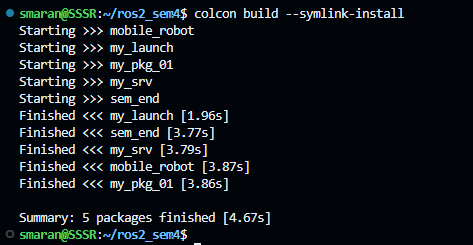
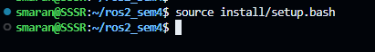
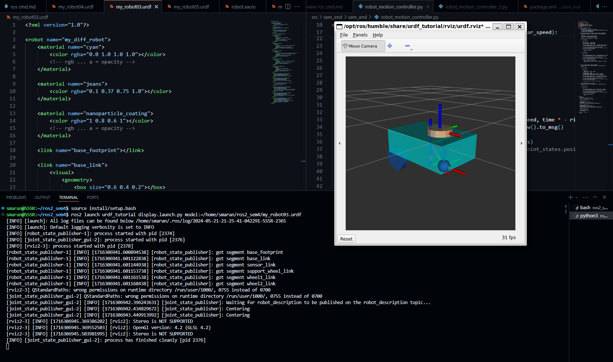
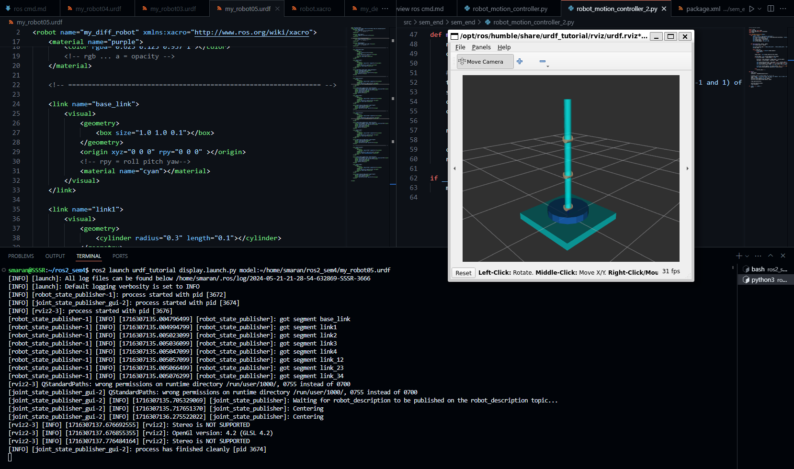
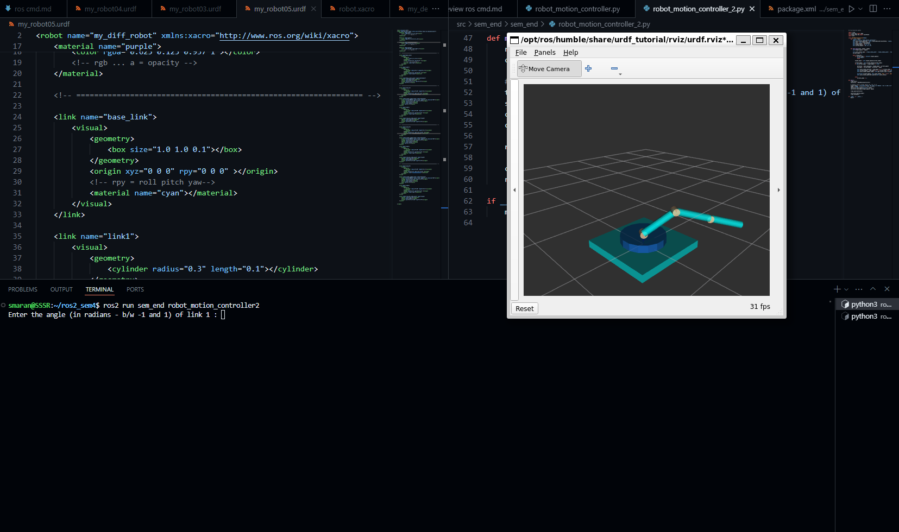

# ROS2 Humble Semester 4 SEE Project

## Contents:

### Files:
- `my_robot03.urdf` : URDF file containaing the description of the differential drive robot
- `my_robot05.urdf` : URDF file containaing the description of the 4-DOF Robotic Arm

Directory:
- `src/sem_end` : ROS package containing the python robot_motion_controler nodes  

## Controler Nodes:
- `./src/sem_end/sem_end/robot_motion_controller.py` : Python ROS Humble based controller node to control the differential drive robot's wheels
- `./src/sem_end/sem_end/robot_motion_controller_2.py` : Python ROS Humble based controller node to control the revolute joint angles of the 4-DOF robotic arm

## Execute the Nodes:

1. Build the package 
    - In your workspace directory, launch a terminal and enter `colcon build --symlink-install`

2. Load the source files:
    - In the same terminal, execute `source install/setup.bash`

3. Launch the reuired robot in RViz:
    - Open a new terminal
    - In the same terminal, execute `source install/setup.bash`
    - Then execute `ros2 launch urdf_tutorial display.launch.py model:=<path_to_urdf_file>`

4. Launch the python node:
    - Close the `joint_state_publisher` window to avoid dual input
    - Go to the previous terminal
    - To launch the differential drive motion controler, execute `ros2 run sem_end robot_motion_controller`
    - To launch the 4-DOF robotic arm motion controler, execute `ros2 run sem_end robot_motion_controller2`

## Screenshots:

1. Build the package:  
    

2. Load the source files:  
    

3. Launch the required robot in RViz:
    - Differential drive:   
        
    - 4-DOF robotic arm:
        

4. Launch the python node:
    - Differential drive:   
        
    - 4-DOF robotic arm:
        
